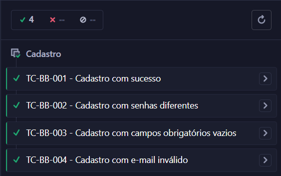
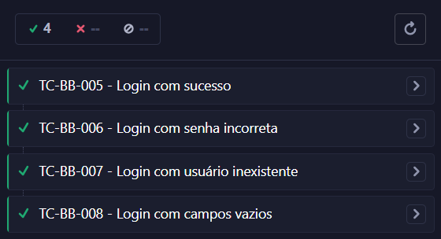
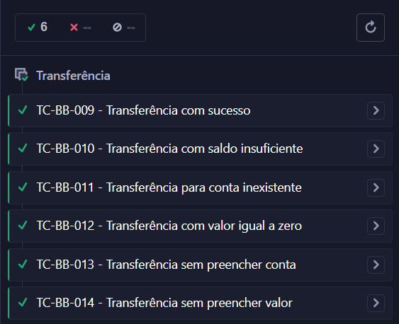
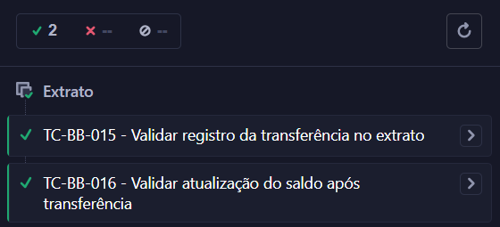
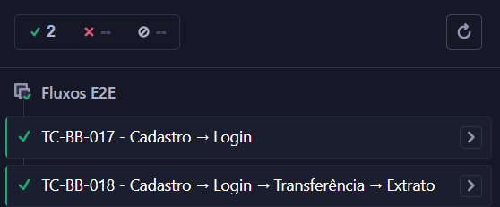

# 🐞 BugBank - Automação de Testes com Cypress

Projeto de automação de testes End-to-End desenvolvido para a aplicação BugBank utilizando **Cypress** e o padrão de projeto **Page Object Model (POM)**.

O objetivo deste projeto é validar os principais fluxos da aplicação, cobrindo funcionalidades de cadastro, login, transferência, extrato e fluxos completos de usuário.

---

# 📋 Objetivo

Este projeto foi desenvolvido para demonstrar conhecimentos em:

- Automação de Testes
- Testes End-to-End (E2E)
- Testes Funcionais
- Cypress
- JavaScript
- Page Object Model (POM)
- Git e GitHub
- Boas práticas de automação

---

# 🛠 Tecnologias Utilizadas

| Tecnologia | Descrição |
|------------|-----------|
|  JavaScript | Linguagem utilizada na automação |
|  Node.js | Ambiente de execução |
|  Cypress | Framework de automação |
|  Git | Controle de versão |
|  GitHub | Hospedagem do projeto |

---

# 📂 Estrutura do Projeto

```text
BugBank-Cypress
│
├── cypress
│   ├── e2e
│   │   ├── register.cy.js
│   │   ├── login.cy.js
│   │   ├── transfer.cy.js
│   │   ├── statement.cy.js
│   │   └── e2e-flow.cy.js
│   │
│   └── support
│       └── pages
│           ├── HomePage.js
│           ├── RegisterPage.js
│           ├── LoginPage.js
│           ├── TransferPage.js
│           └── StatementPage.js
│
├── cypress.config.js
├── package-lock.json
├── package.json
└── README.md
```

---

# ✅ Casos de Teste Automatizados

## Cadastro

| ID | Caso de Teste |
|----|--------------|
| TC-BB-001 | Cadastro com sucesso |
| TC-BB-002 | Cadastro com senhas diferentes |
| TC-BB-003 | Cadastro com campos obrigatórios vazios |
| TC-BB-004 | Cadastro com e-mail inválido |

---

## Login

| ID | Caso de Teste |
|----|--------------|
| TC-BB-005 | Login com sucesso |
| TC-BB-006 | Login com senha incorreta |
| TC-BB-007 | Login com usuário inexistente |
| TC-BB-008 | Login com campos vazios |

---

## Transferência

| ID | Caso de Teste |
|----|--------------|
| TC-BB-009 | Transferência com sucesso |
| TC-BB-010 | Transferência para conta inexistente |
| TC-BB-011 | Transferência com saldo insuficiente |
| TC-BB-012 | Transferência com valor zero |
| TC-BB-013 | Transferência sem preencher conta |
| TC-BB-014 | Transferência sem preencher valor |

---

## Extrato

| ID | Caso de Teste |
|----|--------------|
| TC-BB-015 | Validar registro da transferência no extrato |
| TC-BB-016 | Validar atualização do saldo após transferência |

---

## Fluxos End-to-End

| ID | Caso de Teste |
|----|--------------|
| TC-BB-017 | Cadastro → Login |
| TC-BB-018 | Cadastro → Login → Transferência → Extrato |

---

# 📊 Cobertura de Testes

### Funcionalidades Cobertas

✅ Cadastro de Usuário

✅ Login

✅ Transferências

✅ Extrato Bancário

✅ Fluxos End-to-End

---

# 🚀 Como Executar o Projeto

## Clonar o repositório

```bash
git clone https://github.com/lucasjoseaa/Cypress-BugBank_LucasJose.git
```

## Acessar a pasta do projeto

```bash
cd Cypress-BugBank_LucasJose
```

## Instalar dependências

```bash
npm install
```

## Executar o Cypress

```bash
npm run cy:open
```

## Executar todos os testes

```bash
npm run cy:run
```

---

# 🏗 Padrão Utilizado

O projeto foi desenvolvido utilizando o padrão **Page Object Model (POM)**.

Benefícios:

- Melhor organização do código
- Reutilização de métodos
- Maior manutenibilidade
- Facilidade para expansão do projeto

---

# 📈 Resultados

```text
18 Casos de Teste Automatizados
18 Casos de Teste Executados com Sucesso
0 Falhas
```











# 👨‍💻 Autor

**Lucas José**

**(*QA Engineer | Testes Manuais & Automação | Postman | JavaScript | Agile | Testes API*)**

<p align="left">
  <a href="https://github.com/lucasjoseaa"></a>
  <a href="https://www.linkedin.com/in/lucas-jose-alves"></a>
  <a href="mailto:lucasjoseaa@gmail.com"></a>
</p>
  
